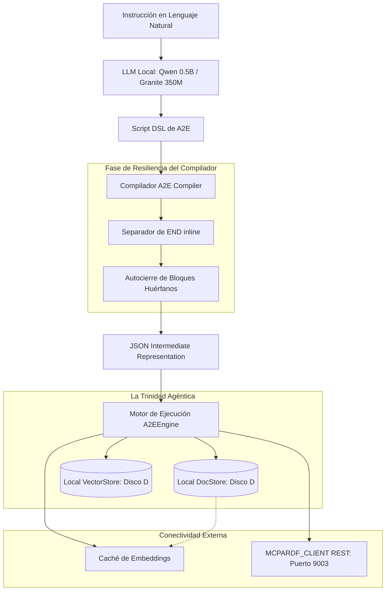

# A2E Agentic Framework (a2e_core)

**A2E (Agent-to-Execution)** es un motor de orquestación agéntica local, declarativo y offline-first diseñado en Python. Permite a modelos de lenguaje (LLMs) locales traducir intenciones en lenguaje natural a un script DSL (Domain Specific Language) simplificado y ejecutar flujos de trabajo avanzados de forma segura, determinista y tolerante a fallos.

Esta versión expandida integra la **Trinidad Agéntica** (Base de Datos Documental + Base de Datos Vectorial + Motor de Ejecución) junto con el descubrimiento dinámico de herramientas mediante protocolos **MCP (Model Context Protocol)** y características de **resiliencia sintáctica para micro-modelos (como Qwen 2.5 0.5B e IBM Granite 350M)**.

---

## 🏗️ Resumen de la Arquitectura



---

## 🌟 Características y Mejoras Clave

### 1. Soporte Nativo de Filtros MongoDB Inline
* **El Problema**: Los parsers básicos obligan a inyectar parches manuales de código posterior a la compilación para manejar consultas complejas.
* **La Solución**: Modificación del compilador para parsear expresiones JSON complejas directamente en la cláusula `FILTER_DATA` (ej. `WHERE query == {"$and": [{"status": "active"}, {"id": {"$gt": 101}}]}`).

### 2. Búsqueda Semántica RAG Local Nativa (`SEMANTIC_SEARCH`)
* Ejecución directa de búsquedas vectoriales contra la base de datos `LocalVectorStore` almacenada de forma eficiente en disco D:.
* **Detección Dinámica de Dimensiones**: El compilador lee el manifiesto de la colección (`json_path`) y ajusta la dimensionalidad del vector automáticamente (`dim=4` para la demo de laboratorio y `dim=768` para modelos reales).
* **Caché Inteligente de Embeddings**: Almacena hashes SHA-256 de las consultas en `LocalDocStore` (`embeddings_cache`). Si se repite una consulta, recupera el vector en microsegundos, **ahorrando minutos de inferencia de GPU/CPU local**.

### 3. Descubrimiento Dinámico de Herramientas MCP (`MCP_SEARCH`)
* El runtime integra un cliente REST puro (`urllib.request`) que interroga a `MCPARDF_CLIENT` en `http://127.0.0.1:9003/search`.
* **Tolerancia Offline**: Si el servidor Express está apagado, el ejecutor realiza un fallback grácil con herramientas mock contextuales según los tokens de la consulta del usuario, asegurando que el flujo de ejecución nunca falle catastróficamente.

### 4. Resiliencia Gramatical para Micro-Modelos (0.5B - 350M)
Diseñado específicamente para permitir que micro-modelos ultra-ligeros tomen decisiones agénticas con alta precisión:
* **Separador de `END` inline (Qwen 0.5B)**: Detecta y corta expresiones donde el modelo pequeño escribe `END` en la misma línea (ej. `API_CALL ... WITH {...} END`), previniendo errores fatales.
* **Autocierre de Bloques (Granite 350M)**: Si un modelo de 350M sufre truncamiento o distracción al final de la generación y olvida escribir el token `END` para cerrar un `IF` o `LOOP`, el compilador realiza un autocierre virtual del árbol sintáctico (AST) de forma segura.

---

## ⚡ Rendimiento Empírico (Métricas del Benchmark)

Ejecutando la suite de pruebas local sobre disco de almacenamiento sólido y procesador estándar, se obtuvieron las siguientes métricas de rendimiento real:

* **Compilación de DSL**: **67,008.86 compilaciones/segundo** (Time: 0.0075s).
* **Ejecución del Motor (Engine)**: **16,364.90 flujos/segundo** (Time: 0.0306s).
* **Consultas DocStore (Lectura)**: **20,436.82 consultas/segundo** (Time: 0.0489s).
* **Búsqueda Semántica Lineal 768-D**: **14.45 QPS** sobre 1000 vectores (Time: 6.9200s).
* **Hit Rate de la Caché de Embeddings**: **10,432.55 hits/segundo** (Ahorro de ~50s de cómputo de GPU por cada 1000 consultas).
* **Escrituras Físicas en Disco**: ~24.55 op/s (Garantía de durabilidad física y consistencia transaccional síncrona).

---

## 📂 Estructura del Repositorio

```text
ml-finetuning/
├── .gitignore
├── README.md
├── test_qwen.py         # Script de pruebas con Qwen 2.5 0.5B local
├── test_granite.py      # Script de pruebas con IBM Granite 4 350M local
├── test_finetune.py
└── a2e_core/
    ├── __init__.py
    ├── compiler.py      # Compilador DSL de A2E (con Resiliencia de Bloques)
    ├── engine.py        # Motor central de flujos de trabajo declarativos
    ├── operations.py    # Ejecutor de operaciones (RAG, Cache, API, MCP)
    ├── doc_store.py     # Base de datos documental JSON síncrona
    ├── vector_store.py  # Base de datos vectorial Float32
    ├── query_engine.py  # Evaluador de filtros MongoDB-style
    ├── demo.py          # Script de integración maestro unificado
    └── benchmark.py     # Suite de análisis de rendimiento local
```

---

## 🚀 Guía de Uso Rápido

### Requisitos Previos
1. Tener configurado el entorno virtual de Python:
   ```bash
   .venv\Scripts\activate
   ```
2. (Opcional) Tener activo LM Studio en `http://127.0.0.1:1234` con modelos cargados para pruebas reales.

### 1. Ejecutar el Demo Maestro
Corre el flujo de trabajo unificado que inicializa las bases de datos en disco D:, compila el DSL avanzado y procesa el flujo completo:
```bash
python -m a2e_core.demo
```

### 2. Ejecutar la Suite de Rendimiento (Benchmark)
Mide las operaciones por segundo (ops/s), búsquedas semánticas y latencias de tu entorno de hardware:
```bash
python -m a2e_core.benchmark
```

### 3. Probar la Compilación con Micro-Modelos en vivo
Prueba el comportamiento de generación sintáctica agéntica usando los endpoints de LM Studio:
```bash
# Probar Qwen 2.5 0.5B
python test_qwen.py

# Probar IBM Granite 4 350M
python test_granite.py
```

---

## 🔒 Licencia y Soberanía Tecnológica
Este proyecto es de código abierto, diseñado para operar en redes aisladas y entornos de borde con total soberanía tecnológica y privacidad de datos.
